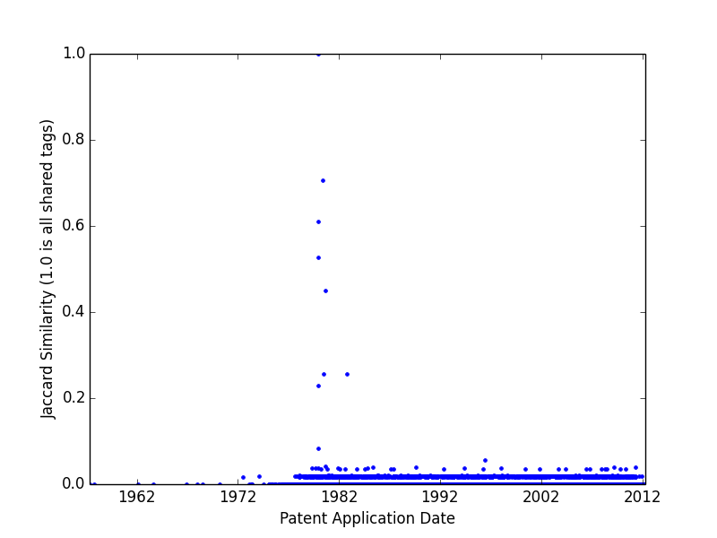
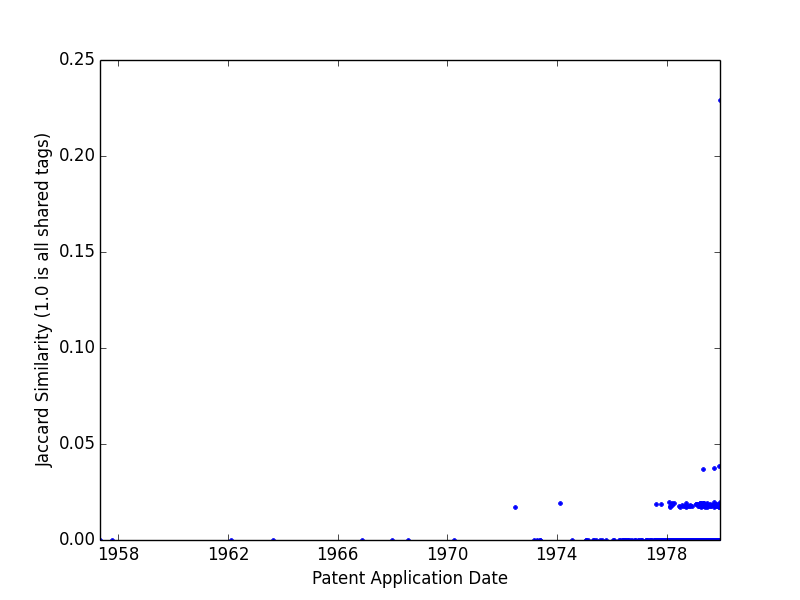

# Histogram Generator

For a given patent, it is helpful to obtain similarity histograms of patents that are applied for
both before and after.

We can generate CSV files of these similarity scores for a given patent:

```
go run generateHistogramData.go ../cleantech_data/raw_tags.csv 4303061
```

This will generate `after.csv` and `before.csv`, which each have the schema

```
patent number, jaccard similarity
```

where the jaccard distance is 1.0 if the patents have no shared tags, and 0.0
if they have all shared tags. The Porter word stemming algorithm is applied.

After this output is generated, we can create the histograms by running

```
python generateHistograms.py before.csv after.csv
```

This will generate two nice histograms in `before.png` and `after.png`
that will look something like the following




## Timeseries

An additional output of `generateHistogramData.go` are `afterTS.csv` and `beforeTS.csv`,
which are CSV files of timeseries data with schema:

```
patent application date, jaccard similarity
```

These can be plotted using the script

```
python generateTSHistograms.py beforeTS.csv afterTS.csv
```

Sample output coming
